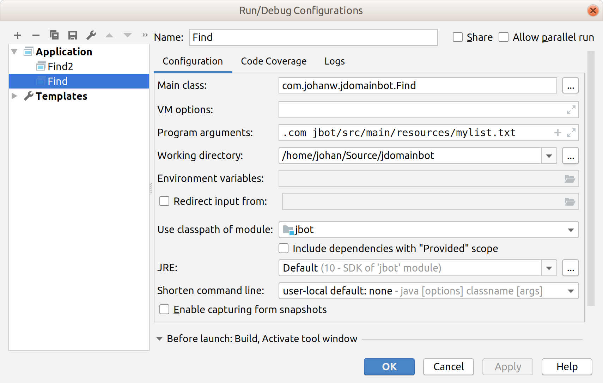
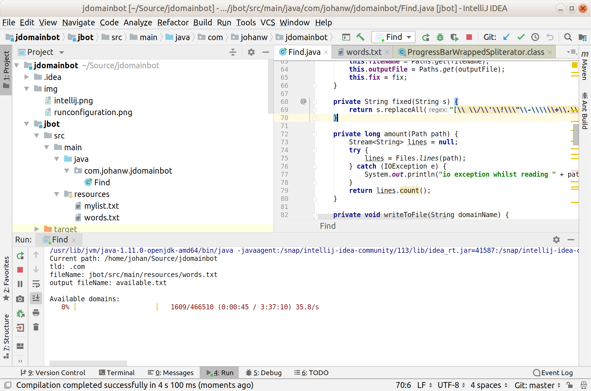

# jdomainbot

## Purpose

Bulk search a list of domain names and check for their availability. List of domains is provided in a csv file you provide

## How

Usage: java com.johanw.jdomainbot.Find TLD fileWithWords outputFile [fix]
Where: TLD the extension, e.g. .com
       fileWithWords is the file containing domains to lookup
       outputFile is the file to output the list of available domains
       fix keyword can be added which will remove spaces and special characters from the words from the fileWithWords. For example, john's stuff will become johnsstuff when you specify the fix parameter

## Build
mvn clean install

## Command line example

Example contents of mylist.csv:

```
johan
peter
john
thissurelydoesntexistdoesit
johny
doesthisexist
iwouldntknow
```

Output of running java com.johanw.jdomainbot.Find .com mylist.csv:

```
The output of the above is:
Current path: /home/johan/Source/jdomainbot
tld: .com
fileName: jbot/src/main/resources/mylist.txt

Available domains:
  thissurelydoesntexistdoesit.com
  iwouldntknow.com

Done
```

## Intellij screenshots



